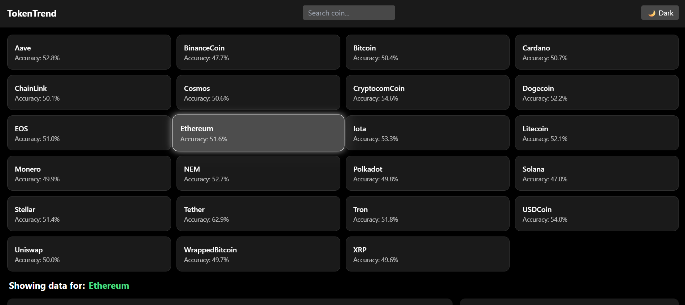
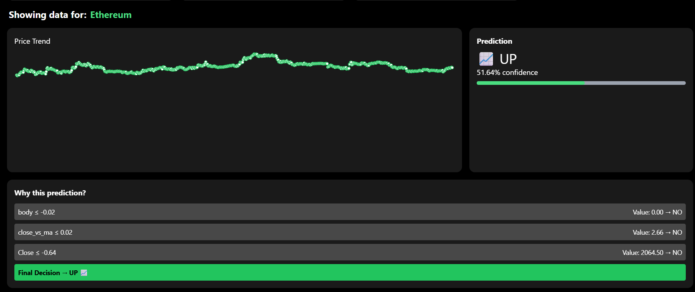

# 🚀 TokenTrend – AI-Powered Crypto Prediction Dashboard

---

## 👥 Team Name
Team

---

## 👨‍💻 Team Members
- Member 1: Ishant Verma – (https://github.com/Izz-ve)
- Member 2: Amogh Saagar – (https://github.com/Amogh-Saagar)
- Member 3: Anvesha Gupta – (https://github.com/anvesha-gupta) 
- Member 4: Venugopal Bedar – (https://github.com/venugopalbedar231)

---

## 🔗 Project Links
- 📊 PPT: (Will submit later)
- 🌐 Hosted Demo: (https://kik-intras-team6.vercel.app/)

---

## 🧠 Technical Implementation

### 1. 📊 Data Pipeline & Feature Engineering
- Integrated **live crypto data** using the CoinGecko API
- Extracted last 30 days of historical price & volume data
- Generated meaningful features such as:
  - Daily returns (`ret_1d`)
  - Moving averages (`ma_7`)
  - Rolling returns (`rolling_ret3`)
  - Volatility
  - Volume change
  - Price vs moving average (`close_vs_ma`)
- Ensured features match training data structure for real-time inference

---

### 2. 🤖 The Machine Learning Engine
- Used **Decision Tree models** trained on historical crypto datasets
- Each coin has its own:
  - Accuracy score
  - Feature-based decision tree
- Implemented **client-side inference**:
  - Traverses decision tree dynamically
  - Outputs prediction:
    - 📈 UP (Bullish)
    - 📉 DOWN (Bearish)
- Provides **explainability** via decision path visualization

---

### 3. 🌐 Interactive Web Dashboard & Inference
- Built using **React (Vite) + Tailwind CSS**
- Key features:
  -  Coin search functionality
  -  Dark/Light theme toggle
  -  Live price chart (Recharts)
  -  AI prediction panel with confidence score
  -  Confidence heatmap glow (visual strength indicator)
  -  Decision tree path explanation (step-by-step)
  -  Fully responsive UI for all devices
- Real-time inference triggered on coin selection

